# Dependencias y orden

Las dependencias del CSV son finish-to-start: deben satisfacer su aceptación antes de empezar el consumidor. Un número ID mayor puede preceder a otro menor. Comprobación programática: DAG sin ciclos ni referencias inexistentes. Las fases se comportan además como puertas de liberación; el grafo muestra dependencias de tarea, no todos los arcos redundantes de esas puertas.

## Ruta crítica técnica

Con duraciones mínimas: **T-001 → T-002 → T-004 → T-014 → T-015 → T-018 → T-019 → T-020 → T-038 → T-039 → T-040 → T-041 → T-042 → T-059 → T-061 → T-068 → T-070 → T-074 → T-076 → T-077**, 248 h seriales. Con duraciones máximas: **T-001 → T-002 → T-004 → T-014 → T-015 → T-018 → T-019 → T-020 → T-038 → T-039 → T-040 → T-041 → T-042 → T-059 → T-061 → T-068 → T-070 → T-074 → T-076 → T-077**, 404 h seriales. Cálculo: fin temprano(t)=duración(t)+máximo(fin temprano de predecesores); se reconstruye el camino al nodo con mayor fin. Es una cota técnica sin restricciones de recursos, no el plazo final.

El modelo por perfiles y puertas de fase da 18.27–30 semanas antes de reserva. [calendario-calculado.json](calendario-calculado.json) detalla inicio/fin de cada tarea para ambos extremos; [resumen-calculado.json](resumen-calculado.json) conserva sumas y rutas. No se declara óptimo el orden voraz del modelo.

| Perfil principal | Horas min–max | Capacidad semanal | Cota por capacidad, semanas |
|---|---:|---:|---:|
| Backend / líder técnico | 440–712 | 60 | 7.3–11.9 |
| Frontend Vue | 228–380 | 30 | 7.6–12.7 |
| QA / automatización | 72–116 | 15 | 4.8–7.7 |
| DevOps / seguridad | 116–208 | 15 | 7.7–13.9 |

## Paralelo posible y secuencias obligatorias

- Tras T-001, rotación T-003 y restore T-002 son independientes; no retrasar revocación esperando limpieza Git.
- Tras T-004 y el harness T-014, dos backend pueden repartir portal/PDF y sesiones/pago; frontend aborda chat/HTML/demo. Evitar dos cambios simultáneos en el mismo servicio de factura.
- T-015 precede migraciones aditivas; T-016 resuelve identidad antes de T-017 FK. T-018 examina duplicados antes de crear unicidad. Índices de rendimiento no requieren migrar identidad salvo que usen esa relación.
- T-022 precede correo y reset; T-024 necesita rate limit T-029; T-025 espera contratos completos. Backend puede construir ledger de pago mientras frontend prepara UI.
- Rotar T-003 precede reescritura T-037; coordinar clones y no automatizar un force-push sin autorización específica.
- T-047 outbox precede consumidor T-048 y cron T-049; el lector financiero no depende de que se entregue el correo.
- T-059 y T-060 son técnicamente paralelos, pero con un frontend compiten por capacidad; añadir otro recurso requiere recalcular.
- Formato T-067 debe coordinarse con ramas UI para evitar conflictos; no mezclarlo en parches de seguridad.

## Grafo completo

La lista completa está en CSV y el diagrama incluye las 77 tareas.

```mermaid
flowchart TD
  T001["T-001: Fijar alcance, responsables y entorno de trabajo"]
  T002["T-002: Probar backup y restauración antes de cambiar datos"]
  T003["T-003: Rotar las credenciales históricas y revocar sesiones"]
  T004["T-004: Capturar la línea base reproducible y presupuestos"]
  T005["T-005: Aislar el portal mediante el ID autenticado"]
  T006["T-006: Persistir únicamente la clave PDF de la factura"]
  T007["T-007: Limpiar el chat cuando cambia la sesión"]
  T008["T-008: Revocar refresh y cerrar cookie con acceso vencido"]
  T009["T-009: Asignar referencia Bold de forma atómica"]
  T010["T-010: Retirar cuentas de ejemplo y asegurar primer administrador"]
  T011["T-011: Contener mutaciones financieras fuera del dominio"]
  T012["T-012: Escapar nombres de usuario en las vistas"]
  T013["T-013: Identificar demos y retirar telemetría ficticia de producción"]
  T014["T-014: Preparar integración aislada con PostgreSQL"]
  T015["T-015: Definir baseline de esquema y runner explícito"]
  T016["T-016: Conciliar vínculos de usuarios y suscriptores"]
  T017["T-017: Añadir relaciones y FK de identidad"]
  T018["T-018: Proteger unicidad financiera e índices medidos"]
  T019["T-019: Centralizar emisión y actualización de facturas"]
  T020["T-020: Proteger la secuencia de lecturas y sus correcciones"]
  T021["T-021: Registrar pagos manuales y ajustes auditables"]
  T022["T-022: Crear tokens de invitación y activación de un solo uso"]
  T023["T-023: Entregar invitaciones verificables por correo"]
  T024["T-024: Habilitar recuperación pública segura de contraseña"]
  T025["T-025: Completar UI de activación y recuperación"]
  T026["T-026: Hacer transaccional el alta de persona, cuenta y dirección"]
  T027["T-027: Persistir intentos y eventos de pago conciliables"]
  T028["T-028: Conciliar webhooks desconocidos y cobros históricos"]
  T029["T-029: Limitar abuso de login y registro sin bloquear el hilo"]
  T030["T-030: Alinear permisos por operación entre UI y API"]
  T031["T-031: Reproducir contenedores desde el lock y runtime único"]
  T032["T-032: Declarar variables y persistencia por entorno"]
  T033["T-033: Unificar cabeceras HTTP con política compatible con Bold"]
  T034["T-034: Reenviar Socket.IO y verificar reconexión"]
  T035["T-035: Añadir health de aplicación y dependencias"]
  T036["T-036: Cerrar regresión HTTP y navegador de los riesgos altos"]
  T037["T-037: Sanear historial tras revocar secretos y añadir prevención"]
  T038["T-038: Validar contratos financieros e ID de ruta"]
  T039["T-039: Validar DTO e IDs del resto del CRUD"]
  T040["T-040: Acotar listados y corregir enlaces de paginación"]
  T041["T-041: Eliminar N+1 y añadir búsqueda paginada"]
  T042["T-042: Paginar búsquedas y listas administrativas completas"]
  T043["T-043: Acordar definiciones de consumo, recaudo y vencimiento"]
  T044["T-044: Tratar fechas de calendario y mora de forma uniforme"]
  T045["T-045: Corregir agregación de consumo en los tableros"]
  T046["T-046: Atribuir recaudo a eventos de pago verificables"]
  T047["T-047: Añadir outbox transaccional de eventos de facturación"]
  T048["T-048: Entregar avisos y actividad de forma idempotente"]
  T049["T-049: Recuperar cron omitido sin duplicar avisos"]
  T050["T-050: Conectar actividad real y calidad de datos del tablero"]
  T051["T-051: Asociar etiquetas y mensajes de formularios"]
  T052["T-052: Garantizar foco y teclado en modales"]
  T053["T-053: Dar equivalentes textuales a los gráficos"]
  T054["T-054: Liberar listeners y gráficos al desmontar"]
  T055["T-055: Reducir carga inicial y configurar caché de assets"]
  T056["T-056: Obtener escaneo vigente y mapa de actualización"]
  T057["T-057: Preparar sustitución de BootstrapVue y compat"]
  T058["T-058: Migrar navegación y componentes compartidos"]
  T059["T-059: Migrar componentes administrativos y de entidades"]
  T060["T-060: Migrar login y estilos públicos dependientes"]
  T061["T-061: Retirar compat y dependencias obsoletas del runtime"]
  T062["T-062: Validar inventario de datos, finalidades y proveedores"]
  T063["T-063: Publicar política coherente con la operación comprobada"]
  T064["T-064: Guardar evidencia de autorización cuando corresponda"]
  T065["T-065: Completar consentimiento y atención de derechos en UI"]
  T066["T-066: Aplicar purga por retención sin romper sesiones ni idempotencia"]
  T067["T-067: Normalizar formato en cambio separado"]
  T068["T-068: Resolver reglas semánticas y añadir tipos Vue a CI"]
  T069["T-069: Conectar métricas, alertas y correlación operativa"]
  T070["T-070: Hacer obligatoria la regresión completa y cerrar F3"]
  T071["T-071: Incluir recursos públicos en el artefacto"]
  T072["T-072: Completar metadatos públicos y comportamiento 404"]
  T073["T-073: Resolver licencia del producto y atribuciones"]
  T074["T-074: Documentar operación, API y onboarding comprobados"]
  T075["T-075: Retirar implementaciones no montadas y duplicación acotada"]
  T076["T-076: Reauditar el cierre completo de hallazgos"]
  T077["T-077: Ensayar recuperación y respuesta a incidentes trimestral"]
  T001 --> T002
  T001 --> T003
  T001 --> T004
  T002 --> T004
  T004 --> T005
  T014 --> T005
  T004 --> T006
  T014 --> T006
  T004 --> T007
  T014 --> T007
  T004 --> T008
  T014 --> T008
  T004 --> T009
  T014 --> T009
  T002 --> T010
  T003 --> T010
  T014 --> T010
  T004 --> T011
  T014 --> T011
  T004 --> T012
  T014 --> T012
  T004 --> T013
  T014 --> T013
  T004 --> T014
  T002 --> T015
  T014 --> T015
  T005 --> T016
  T015 --> T016
  T016 --> T017
  T009 --> T018
  T015 --> T018
  T011 --> T019
  T018 --> T019
  T019 --> T020
  T019 --> T021
  T010 --> T022
  T015 --> T022
  T022 --> T023
  T008 --> T024
  T022 --> T024
  T029 --> T024
  T023 --> T025
  T024 --> T025
  T014 --> T026
  T017 --> T026
  T018 --> T027
  T019 --> T027
  T027 --> T028
  T014 --> T029
  T005 --> T030
  T014 --> T030
  T004 --> T031
  T003 --> T032
  T031 --> T032
  T031 --> T033
  T032 --> T033
  T013 --> T034
  T031 --> T034
  T032 --> T035
  T005 --> T036
  T006 --> T036
  T007 --> T036
  T008 --> T036
  T009 --> T036
  T020 --> T036
  T021 --> T036
  T025 --> T036
  T026 --> T036
  T028 --> T036
  T030 --> T036
  T035 --> T036
  T003 --> T037
  T010 --> T037
  T019 --> T038
  T020 --> T038
  T038 --> T039
  T030 --> T039
  T039 --> T040
  T017 --> T041
  T018 --> T041
  T040 --> T041
  T041 --> T042
  T021 --> T043
  T028 --> T043
  T043 --> T044
  T043 --> T045
  T020 --> T045
  T043 --> T046
  T028 --> T046
  T021 --> T046
  T015 --> T047
  T019 --> T047
  T028 --> T047
  T047 --> T048
  T048 --> T049
  T044 --> T049
  T048 --> T050
  T025 --> T051
  T051 --> T052
  T045 --> T053
  T004 --> T054
  T054 --> T055
  T003 --> T056
  T031 --> T056
  T056 --> T057
  T057 --> T058
  T052 --> T058
  T058 --> T059
  T042 --> T059
  T058 --> T060
  T025 --> T060
  T059 --> T061
  T060 --> T061
  T055 --> T061
  T003 --> T062
  T023 --> T062
  T028 --> T062
  T062 --> T063
  T029 --> T063
  T032 --> T063
  T035 --> T063
  T062 --> T064
  T015 --> T064
  T064 --> T065
  T063 --> T065
  T062 --> T066
  T015 --> T066
  T008 --> T066
  T036 --> T067
  T067 --> T068
  T061 --> T068
  T035 --> T069
  T028 --> T069
  T049 --> T069
  T036 --> T070
  T068 --> T070
  T069 --> T070
  T061 --> T070
  T065 --> T070
  T066 --> T070
  T053 --> T070
  T052 --> T070
  T039 --> T070
  T040 --> T070
  T041 --> T070
  T042 --> T070
  T044 --> T070
  T045 --> T070
  T046 --> T070
  T050 --> T070
  T061 --> T071
  T071 --> T072
  T061 --> T073
  T056 --> T073
  T070 --> T074
  T032 --> T074
  T063 --> T074
  T061 --> T075
  T070 --> T075
  T070 --> T076
  T071 --> T076
  T072 --> T076
  T073 --> T076
  T074 --> T076
  T075 --> T076
  T037 --> T076
  T017 --> T076
  T018 --> T076
  T026 --> T076
  T016 --> T076
  T015 --> T076
  T010 --> T076
  T012 --> T076
  T013 --> T076
  T033 --> T076
  T034 --> T076
  T054 --> T076
  T056 --> T076
  T076 --> T077
```

