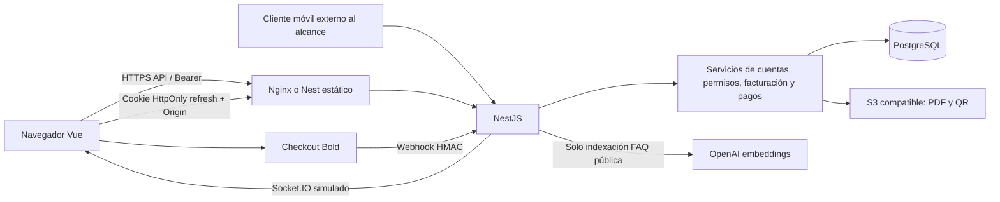

# Arquitectura

Fecha: 5 de octubre de 2026. Alcance: watsolution_web local.

Monorepositorio npm de origen JHipster 8.10.0/blueprint 3.2.0. Cliente SPA Vue 3.5.13 con @vue/compat, Pinia, Vue Router, Vuelidate, BootstrapVue 2 y SCSS; Vite 6.2.4. API NestJS 11.2.7, TypeORM 0.3.31, pg 8.14.1. Node instalado para comprobaciones: 24.15.0. Versiones tomadas del lock, no del catálogo remoto.



La separación módulos/controladores/servicios/DTO es legible. Hay 15 módulos de negocio/autenticación y una aplicación raíz; AppModule importa servicios de calendario, estáticos y ORM. El móvil se revisa solo por su API en este repositorio. Integraciones: Bold, bucket S3 compatible, OpenAI para FAQs; las consultas personales de IA son locales en el estado actual (ai.service.ts:29–50). No se encontró implementación de WhatsApp/SMS pese a mencionarse en política.

El estado financiero, las sesiones y los límites de login dependen de PostgreSQL; su disponibilidad es un punto compartido. PDF/QR agregan dependencia síncrona del bucket. Escalar instancias requiere coordinar cron y garantizar integridad de referencias. La configuración se reparte entre YAML, process.env, Docker y Railway; no hay configuración de staging específica. Dos topologías están codificadas: monolito con estáticos en Nest y servicios separados con Nginx. Ver WS-036–038 antes de elegir una.

No se atribuyen defectos al otro proyecto watsolution_mobil: está fuera del alcance.

### [WS-046] Coexisten implementaciones de vistas que ya no se usan
- **Categoría:** Arquitectura
- **Severidad:** Baja
- **Ubicación:** client/src/app/views/pagos/pagos.component.ts:33
- **Evidencia:**

```text
33:       isPaying.value = true;
34:       errorMsg.value = '';
35:       try {
36:         await new Promise(resolve => setTimeout(resolve, 1500));
37:         successMsg.value = `Pago de ${formatCurrency(totalAmount.value)} procesado correctamente. Serás redirigido a tu banco.`;
38:       } finally {
39:         isPaying.value = false;
```

No se reporta el pago simulado de este archivo como comportamiento activo; sí es deuda de código muerto.

- **Impacto:** Vistas activas usan script setup inline, mientras archivos .component.ts mantienen otra implementación: pagos simulado, facturación sin meterId y dashboards de ejemplo. El router importa .vue, no esas alternativas. Confunde mantenimiento y puede dar falsa confianza al probar código no montado.
- **Recomendación:** Identificar referencias con el grafo de imports, retirar código obsoleto en un cambio aparte y extraer layouts/composables comunes. Asegurar que pruebas importen componentes montados por el router.
- **Esfuerzo estimado:** Medio


## Límites de verificación

Auditoría del estado local del 5 de octubre de 2026 (America/Bogota), incluidos cambios preexistentes. Las conclusiones son estáticas salvo pruebas expresamente descritas. No se arrancó Nest ni se conectó a PostgreSQL, Railway, S3 o Bold; no se instalaron paquetes ni se ejecutaron migraciones. No se validaron datos reales, cabeceras desplegadas, TLS, IAM, backups/restauración, carga, Core Web Vitals, contraste o navegación con lector de pantalla. No se certifica ausencia de vulnerabilidades. La consulta online de npm fue bloqueada por la revisión automática por el envío de metadatos; CVE actuales y versiones más recientes: **No verificado**. Las consultas web realizadas fueron genéricas a fuentes oficiales de privacidad y accesibilidad, sin enviar código ni inventarios.
